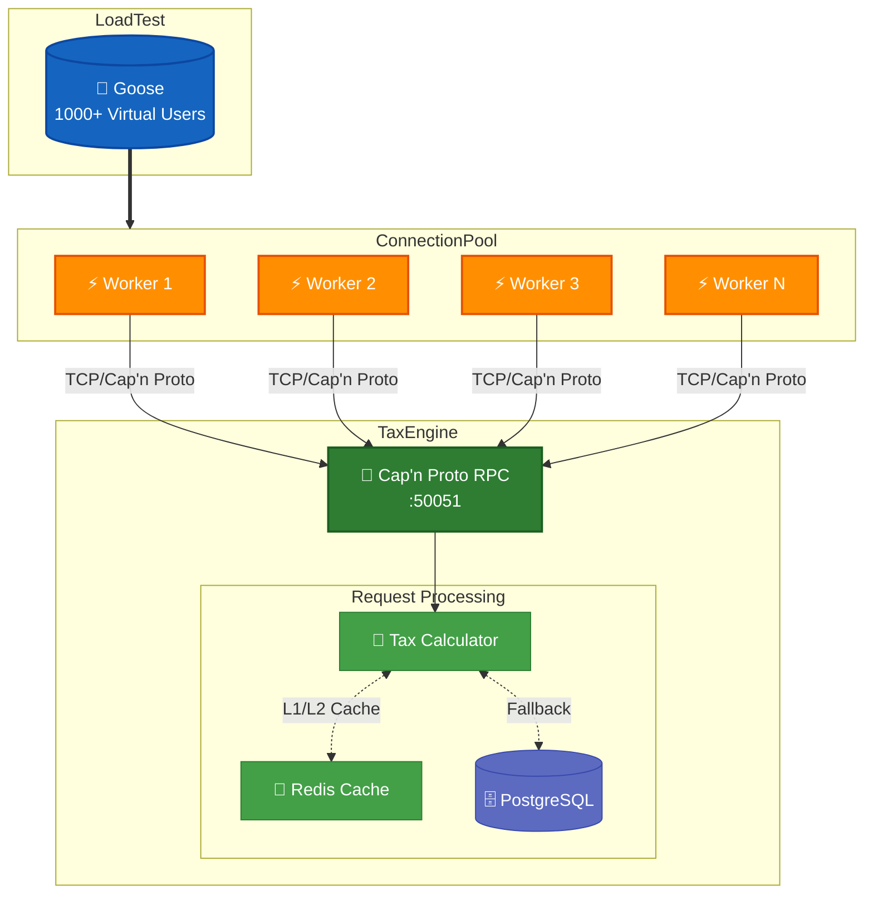

# Microservicio de Impuestos

Este proyecto es un motor centralizado y de alto rendimiento para el cálculo de gravámenes impositivos en transacciones bancarias. Está diseñado para garantizar precisión y cumplimiento de normativas fiscales vigentes.

## Propósito
El microservicio centraliza la lógica de determinación de impuestos (IVA, SELLOS, IIBB, Ganancias), permitiendo una gestión ágil de perfiles impositivos y reglas de negocio, asegurando que cada transacción sea procesada bajo el marco legal correcto.

## Arquitectura (Modelo C4)
El diseño del sistema sigue el modelo C4 para proporcionar diferentes niveles de abstracción técnica:

-  **[Nivel 1: Contexto](docs/contexto.md)** <br/>
  Visión general del sistema y sus interacciones con actores externos (Usuarios, People Center, etc.).
-  **[Nivel 2: Contenedores](docs/contenedores.md)** <br/>
  Detalle de las unidades ejecutables (Microservicio Tax Engine, Base de Datos PostgreSQL, Cache Redis).
-  **[Nivel 3: Componentes](docs/componentes.md)** <br/>
  Estructura interna del microservicio (Orquestador, Gestor de Perfiles, Calculadores, Motor de Exenciones).
-  **[Nivel 4: Código](docs/codigo.md)** <br/>
  Diseño detallado de structs y tipos implementados en Rust.

## Stack Tecnológico

La selección del stack está estrictamente orientada a minimizar la latencia y maximizar el throughput en un entorno crítico de transacciones bancarias:

- **Lenguaje: Rust** <br/>
  Proporciona rendimiento de nivel C/C++ sin recolector de basura (GC). La ausencia de pausas por GC garantiza una latencia determinística, esencial para el procesamiento en tiempo real. [Rust Performance & Efficiency](https://www.rust-lang.org/performance)
- **Comunicación: Cap'n Proto** <br/>
  Utiliza un enfoque de "zero-copy" serialización. A diferencia de JSON o Protobuf, los datos se estructuran en memoria de forma que pueden ser enviados por la red y leídos sin un paso intermedio de decodificación/parseo, reduciendo drásticamente el uso de CPU y el tiempo de respuesta. [Cap'n Proto: Introduction](https://capnproto.org/introduction.html)
- **Cache: Redis** <br/>
  Motor de datos en memoria que ofrece respuestas en sub-milisegundos. Permite que el gestor de perfiles resuelva la configuración fiscal del cliente casi instantáneamente sin incurrir en los costos de I/O de una base de datos tradicional en cada cálculo. [Redis: Why is it so fast?](https://redis.io/docs/latest/develop/get-started/faq/)
- **Persistencia: PostgreSQL** <br/>
  Reglas de negocio y versionado de perfiles.
- **Integración: People Center** <br/>
  Datos maestros de clientes.

## Reglas de Negocio
El sistema implementa una serie de requerimientos funcionales críticos:
- **Cálculo de Impuestos**: IVA, SELLOS, IIBB, Ganancias.
- **Gestión de Perfiles**: Soporte para versionado y auditoría.
- **Motor de Exenciones**: Aplicación de certificados y condiciones especiales.
- **Validación e Integridad**: Garantía de datos consistentes antes del cálculo.

## Empezando

### Prerrequisitos
- Docker y Docker Compose instalados.
- VS Code con el plugin de "Dev Containers".

### Levantar ambiente con DevContainers (Recomendado)
Para una experiencia de desarrollo integrada:
1. Abrir el proyecto en VS Code.
2. Hacer clic en "Reopen in Container" cuando aparezca el aviso, o usar la paleta de comandos: `Dev Containers: Reopen in Container`.
3. Esto configurará automáticamente Rust, Cap'n Proto y todas las dependencias necesarias dentro del contenedor.

### Levantar ambiente manualmente
Si prefieres usar la terminal directamente:
```bash
# Construir y levantar servicios (Postgres, Redis, Rust Environment)
docker-compose up -d

# Entrar al contenedor de desarrollo
docker-compose exec tax-engine bash
```

### Comandos Útiles dentro del Contenedor
- `cargo build`: Compilar el microservicio.
- `capnp compile -orust schema.capnp`: Compilar esquemas de Cap'n Proto.
- `cargo test`: Ejecutar toda la suite de pruebas (Unitarias, Integración y E2E).

## Clientes

Este repositorio incluye clientes de ejemplo en varios lenguajes. Consulte la documentación específica de cada cliente:

- Cliente Java: [client/java/README.md](client/java/README.md)
- Cliente Javascript: [client/javascript/README.md](client/javascript/README.md)

## Performance Testing

El proyecto cuenta con una estrategia de pruebas multinivel para garantizar la robustez del motor:

#### Ejecutar

**Prerequisitos**: El servidor RPC debe estar corriendo en `127.0.0.1:50051` (o configurar `RPC_ADDR`).

```bash
# Iniciar el servidor
cargo run --release

# En otra terminal
RPC_ADDR=192.168.1.100:50051 target/release/load-test --users 100 --run-time 30s
```

Para resultados y reportes de pruebas recientes, consulta [PERFORMANCE.md](PERFORMANCE.md).

#### Métricas Reportadas

La prueba genera un reporte detallado que incluye:

| Métrica | Descripción |
|---------|-------------|
| Total Requests | Número total de solicitudes procesadas |
| RPS | Requests por segundo |
| Latencia Min/Avg/Max | Latencias en microsegundos |
| Distribución de Latencia | Histograma con buckets: <1ms, 1-5ms, 5-10ms, >10ms |
| Verificación RT-002 | Indica si se cumplen los requisitos de performance |

#### Arquitectura del Load Test

El load test utiliza un **pool de conexiones** con múltiples workers (uno por CPU core) para:

1. Evitar cuellos de botella en una única conexión RPC
2. Simular tráfico realista desde múltiples clientes
3. Maximizar throughput sin saturar un solo worker


