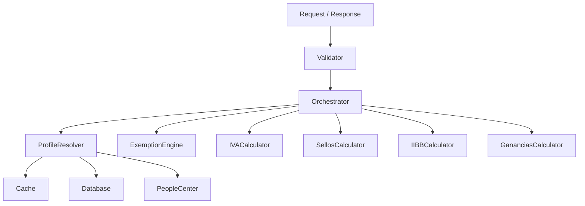

# Diagrama de Código: Tax Engine (C4 - Nivel 4)

Este documento presenta el diseño de los principales structs y tipos en Rust para implementar la lógica definida en el microservicio de impuestos, siguiendo la estructura de componentes del nivel 3.



## Principales Structs y Tipos (Rust)

```rust
// --- Types ---
pub struct Request {
    pub transaction: Transaction,
}

pub struct Response {
    pub breakdown: Vec<TaxBreakdown>,
    pub trace: TraceInfo,
}

// --- Transaction & Profile ---
pub struct Transaction {
    pub amount: f64,
    pub product: String,
    pub jurisdiction: String,
    pub client_id: String,
    pub date: chrono::NaiveDate,
    // ...otros campos relevantes
}

pub struct Profile {
    pub client_id: String,
    pub fiscal_category: String,
    pub exemptions: Vec<Exemption>,
    pub config: ProfileConfig,
}

// --- Validators ---
pub struct Validator;

impl Validator {
    pub fn validate(&self, tx: &Transaction, profile: &Profile) -> Result<(), ValidationError> {
        // ...
    }
}

// --- Orchestrator ---
pub struct Orchestrator {
    pub profile_resolver: ProfileResolver,
    pub exemption_engine: ExemptionEngine,
    pub calculators: Calculators,
}

pub struct Calculators {
    pub iva: IVACalculator,
    pub sellos: SellosCalculator,
    pub iibb: IIBBCalculator,
    pub ganancias: GananciasCalculator,
}

// --- Profile Resolver ---
pub struct ProfileResolver {
    pub cache: Cache,
    pub db: Database,
    pub people_center: PeopleCenter,
}

impl ProfileResolver {
    pub fn resolve(&self, client_id: &str) -> Option<Profile> {
        // ...
    }
}

// --- Exemption Engine ---
pub struct ExemptionEngine;

impl ExemptionEngine {
    pub fn apply(&self, tx: &Transaction, profile: &Profile) -> Vec<Exemption> {
        // ...
    }
}

pub struct Exemption {
    pub tax_type: TaxType,
    pub amount: f64,
    pub valid_until: Option<chrono::NaiveDate>,
}

// --- Calculators (Domain Logic) ---
pub struct IVACalculator;
pub struct SellosCalculator;
pub struct IIBBCalculator;
pub struct GananciasCalculator;

impl IVACalculator {
    pub fn calculate(&self, tx: &Transaction, profile: &Profile) -> TaxBreakdown {
        // ...
    }
}
// ...similar para SellosCalculator, IIBBCalculator, GananciasCalculator

// --- Tax Breakdown ---
pub struct TaxBreakdown {
    pub tax_type: TaxType,
    pub base: f64,
    pub rate: f64,
    pub amount: f64,
    pub applied_exemptions: Vec<Exemption>,
}

pub enum TaxType {
    IVA,
    Sellos,
    IIBB,
    Ganancias,
}

// --- Infra ---
pub struct Cache;
pub struct Database;
pub struct PeopleCenter;

// --- Trazabilidad ---
pub struct TraceInfo {
    pub rules_applied: Vec<String>,
    pub profile_id: String,
    pub calculation_steps: Vec<String>,
}

pub struct ValidationError {
    pub message: String,
}

pub struct ProfileConfig {
    // ...configuración fiscal específica
}
```

⚠️ Continuar personalizando los campos y métodos según las reglas y necesidades reales del dominio
