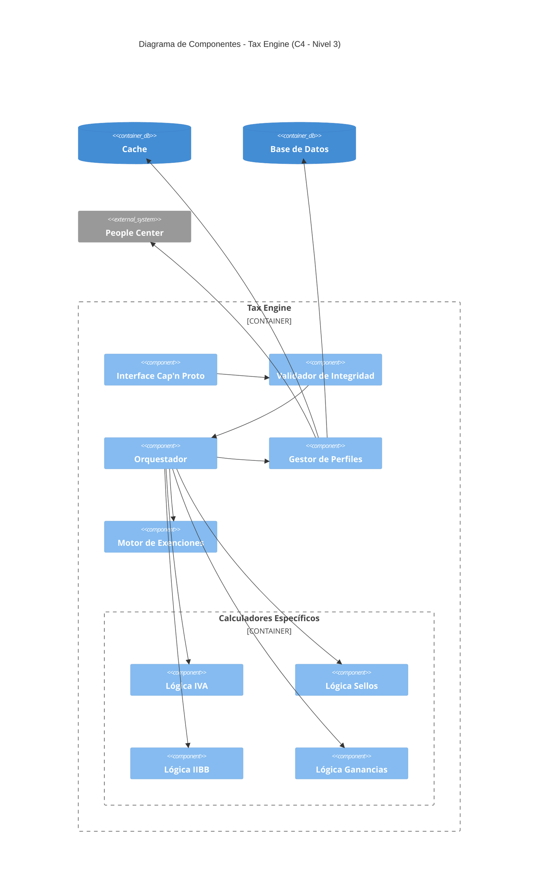
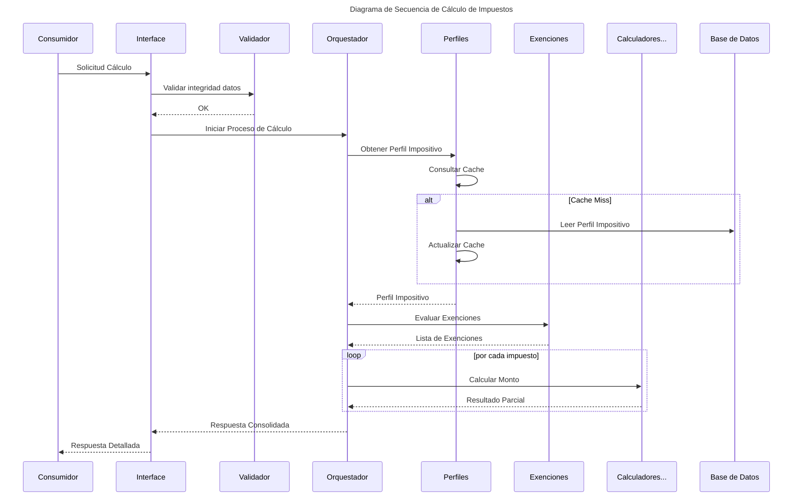

# Diagrama de Componentes: Tax Engine

Este documento detalla la estructura interna del **Tax Engine** (C4 - Nivel 3), describiendo los componentes lógicos que residen dentro del microservicio y cómo colaboran para procesar los cálculos de impuestos.

## Componentes Principales

### 1. Interface Cap'n Proto

Es la frontera de comunicación del microservicio. Implementa el esquema de datos definido para las transacciones bancarias, asegurando una comunicación extremadamente eficiente y con tipado fuerte.

### 2. Validador de Integridad

Asegura que antes de iniciar cualquier cálculo, los datos de la transacción sean consistentes y que las configuraciones requeridas existan en el sistema.

### 3. Gestor de Perfiles

Centraliza la lógica de obtención de la configuración fiscal del cliente. Implementa la estrategia de cache (Redis).

### 4. Orquestador de Cálculo

Es el cerebro del microservicio. Define el orden de ejecución:

1. Obtención del perfil.
2. Identificación de impuestos aplicables según el Módulo Impositivo.
3. Aplicación de exenciones.
4. Ejecución de los calculadores específicos.

### 5. Calculadores Específicos (Domain Logic)

Contienen las reglas de negocio puras para cada tipo de gravamen

- **IVA**: Diferenciación entre general, intereses y comisiones.
- **Sellos**: Lógica basada en la matriz Jurisdicción-Producto.
- **IIBB**: Aplicación de alícuotas por zona geográfica.
- **Ganancias**: Basado en categorías de ganancias.

### 6. Motor de Exenciones

Evalúa certificados de exención cargados en el perfil o en la transacción y determina si el monto imponible debe ser ajustado.

## Diagrama de Secuencia

