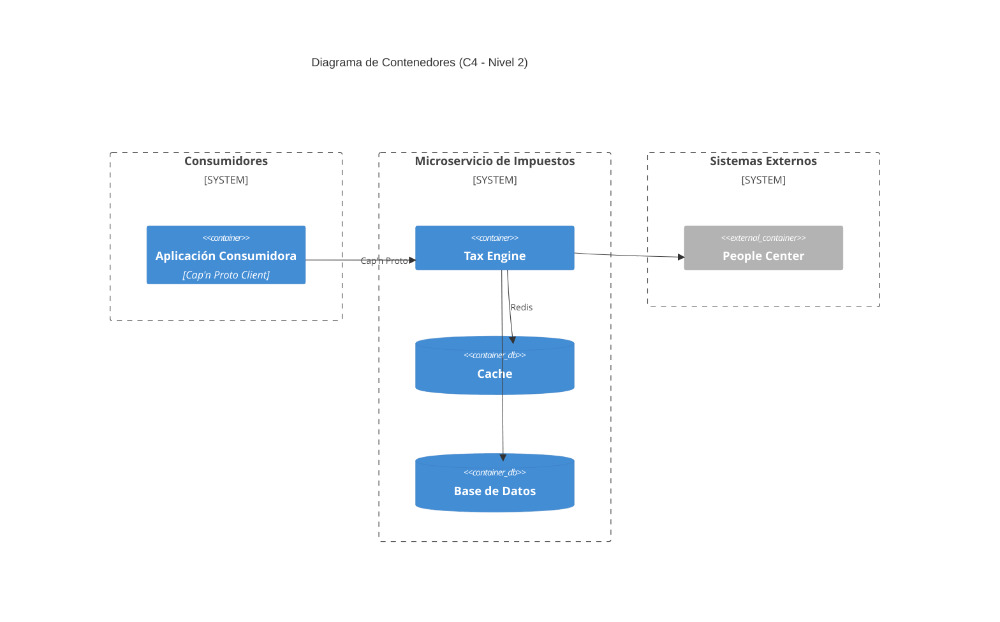

# Diagrama de Contenedores: Microservicio de Impuestos

Este documento describe la arquitectura de segundo nivel (C4 - Nivel 2) del Microservicio de Impuestos, detallando las unidades ejecutables y cómo interactúan entre sí para cumplir con los requerimientos de cálculo y gestión de perfiles.

## Unidades Ejecutables

### 1. Tax Engine Service (Microservicio)

- **Responsabilidad**: Es el núcleo del sistema. Recibe las solicitudes de cálculo, coordina la obtención de datos del perfil, aplica la lógica del Módulo Impositivo y retorna el desglose de impuestos.
- **Protocolo**: Utiliza **Cap'n Proto** para garantizar baja latencia y alta eficiencia en transacciones bancarias.
- **Funciones Clave**:
  - Implementación de algoritmos de cálculo (IVA, SELLOS, etc.).
  - Validación de integridad de datos de entrada.
  - Orquestación entre cache y base de datos persistente.

### 2. Base de Datos (PostgreSQL)

- **Responsabilidad**: Persistencia a largo plazo de la configuración del sistema.
- **Datos almacenados**:
  - **Módulo Impositivo**: Tablas de alícuotas, topes y reglas por jurisdicción.
  - **Perfiles Impositivos**: Configuración específica por cliente/entidad.

### 3. Cache de Perfiles (Redis)

- **Responsabilidad**: Soportar el requerimiento de acceso ultrarrápido.
- **Contenido**: Almacena los perfiles impositivos más consultados y las tablas de alícuotas vigentes para evitar hits innecesarios a la base de datos relacional durante la ejecución del algoritmo de cálculo.

## Interacciones con el Entorno

- **People Center**: El microservicio consulta este componente para validar la identidad del cliente y obtener atributos fiscales base necesarios para identificar el Perfil Impositivo aplicable.
- **Aplicación Consumidora**: Cualquier sistema dentro del ecosistema bancario que necesite determinar el costo impositivo de una operación antes de confirmarla.

## Alineación con Reglas de Negocio

- El uso de **Redis** garantiza el acceso ultrarrápido, mientras que **PostgreSQL** maneja el versionado.
- El **Tax Engine** es el encargado de generar el desglose detallado (base imponible, monto, alícuota) solicitado.
