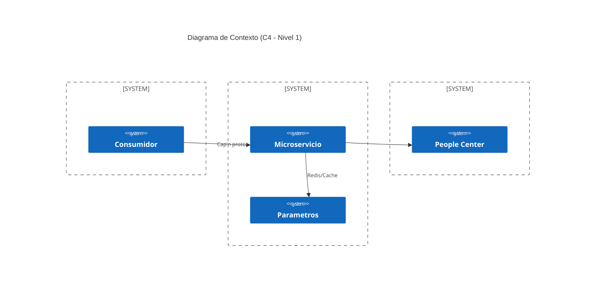

# Contexto del Proyecto: Microservicio de Impuestos

Este microservicio tiene como objetivo centralizar y automatizar el cálculo de diferentes gravámenes impositivos para transacciones bancarias, asegurando el cumplimiento de las normativas vigentes y permitiendo una gestión ágil de perfiles impositivos.

## Propósito

Proveer un motor de cálculo de impuestos preciso, auditable y de alto rendimiento que determine los montos aplicables (SELLOS, IVA, Percepciones, etc.) basándose en la configuración del cliente, las reglas del negocio y los datos específicos de la transacción.

## Alcance del Sistema

### 1. Cálculo de Impuestos

El sistema soporta el cálculo de los siguientes impuestos:

- **SELLOS**: Basado en jurisdicción y tipo de producto.
- **IVA**: Aplicación de alícuotas según categoría fiscal y exenciones.
- **IVA Percepción**: Cálculos sobre conceptos generales, comisiones/gastos e intereses.
- **IIBB Percepción**: Percepciones de Ingresos Brutos por jurisdicción.
- **Ganancias**: Basado en la categoría de ganancias y exenciones.

### 2. Gestión de Perfiles Impositivos

Cada entidad o cliente tiene un perfil configurado que define cómo se le deben aplicar los impuestos.

- **Consulta y Cache**: Acceso optimizado a las configuraciones.

### 3. Módulo Impositivo

Define las reglas lógicas y los parámetros legales (alícuotas, topes, condiciones) que rigen cada tipo de impuesto.

### 4. Exenciones

Capacidad para gestionar exenciones totales o parciales por tipo de impuesto, validando su vigencia y aplicación correcta según la normativa.

## Flujo de Operación General

1. **Entrada de Datos**: Recibe los datos de la transacción (monto, producto, jurisdicción, etc.).
2. **Identificación del Perfil**: Obtiene la configuración impositiva del cliente involucrado.
3. **Algoritmo de Calculo**: Cruza los datos de la transacción con la configuracion y las especificaciones del perfil.
4. **Validación**: Verifica integridad de datos y límites normativos.
5. **Respuesta**: Entrega un desglose detallado con base imponible, alícuotas, montos finales y trazabilidad.

## Objetivos de Calidad

- **Exactitud**: Los cálculos deben ser precisos según la normativa.
- **Trazabilidad**: Cada cálculo debe poder ser auditado, identificando qué reglas y perfiles se aplicaron.
- **Performance**: El sistema debe responder en tiempos mínimos mediante el uso eficiente de cache.
- **Integridad**: Validaciones robustas para evitar cálculos erróneos por datos incompletos.
